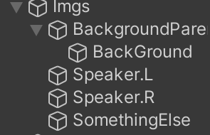
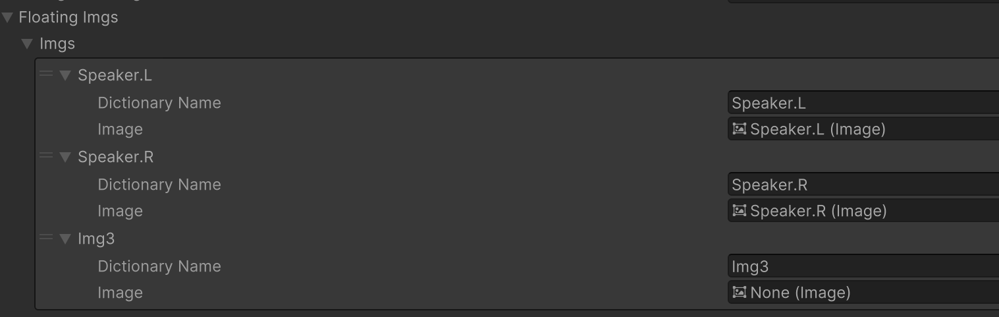
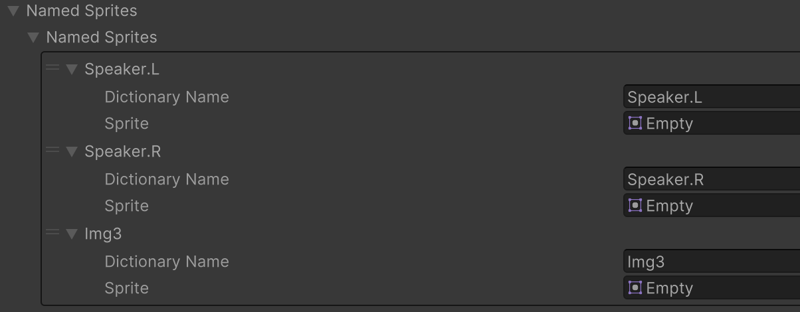
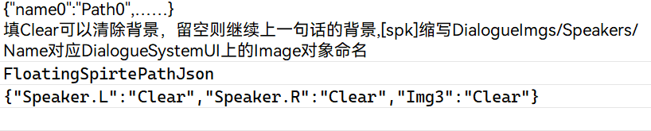

# HXDialogueSystem

这个库是无患用五天手搓的DialogueSystem的示例Unity项目，可以完成基础的对话、选项、背景图和角色图的替换。已测试打包安卓后可以正常工作

后续会更新存档和语音接口

你可以自由使用或修改示例项目中的所有脚本。所有注释都是用中文写的，所以如果你要作修改的话，建议看完注释再改。

示例项目Unity版本：2022.3.17 LTS

25/3/14更新：可以播放对话语音了！

## DialogueSystem：
用于读取、记载和管理所有对话。

示例项目的场景中已经有一个实例化的DialogueSystem。它在`Awake()`时会将自己作为单例并放入DontDestroyOnload。

建议保持它现在的单例形式，并且在你的游戏中保留且仅保留一个实例化的DialogueSystem在游戏的第一个场景内。

场景中有两个按钮，分别能够触发`DialogueSystem.ReloadAlldialoguesFromFile()`（从xlsx中读取对话）和
`DialogueSystem.TriggerDialogue(1)`（开始对话）

你可以从xlsx中读取对话，或者在Inspector中为`DialogueSystem`添加对话，然后才可以开始对话。
在开始对话时，`DialogueSystem`会实例化`DialogueSystem.Instance.UIPrefab`所记载的UI预制体。

详见：DialogueSystemUI和UI prefab

### 开始对话
默认操作是将要触发的对话**的拷贝**传给实例化的`DialogueSystemUI`，避免`DialogueSystemUI`对原对话的修改

### `Content`类
记录每一段对话中的每一句话的内容、说话人、下一句话、语音、要展示的Sprite等

如果这句话是可选的，则记录所有选项

### `Dialogue`类
记录一段对话中所有的内容。同时记录这段对话进行到哪一句了

### 读取xlsx

`DialogueSystem.ReloadAlldialoguesFromFile() `从.xlsx中读取对话。xlsx的格式载于`Assets\Dialogues\TestDialogue.xlsx` 

使用WPS打开xlsx的同时读取xlsx会报错`IOException: Sharing violation on path`。关闭WPS即可

这个方法依赖于NPOI和Newtonsoft这两个库，如果你想在自己的项目中使用这个DialogueSystem，你需要通过Unity NuGet插件或Visual Studio下载这两个库；如果你在自己的项目中不需要从xlsx读取对话，你可以删除这两个库的using.

示例项目已安装这两个库和Unity NuGet

### 谨记：读取xlsx只能在Editor中使用，在打包后则会失效！

如果你想要打包游戏而不是做一个在Editor玩的demo，目前的办法是读取xlsx后在PlayMode下复制DialogueSystem的Component，退出PlayMode，然后Paste Component Value回DialogueSystem上。

## DialogueSystemUI和UI Prefab 
`DialogueSystemUI`类负责管理一个`Dialogue`在UI上的呈现。在对话开始时实例化，并在对话结束后销毁。

你可以自由地修改UI Prefab中各个UI元素，如`Image`和`Text`的位置、旋转和缩放。注意imgs下的各个`Image`：在`DialogueSystemUI`向它们填入`Sprite`时，这个`Imgae`的长宽比会被设置为和Sprite一致

### `DialogueSystem.FloatingImgs`
这个列表记载了imgs下背景以外任何需要使用的`Image`元素，以及它们的“名字”`Dictionary Name`。

`Dictinary Name`**不**一定要和Image实例的命名一致，但**一定**要和`content.namedSprites`列表内每一个`NamedSprite`的`dictionaryName`一致。

同时，如果需要从xlsx读取对话，则需要保持`Dictinary Name`和Json文本中每一对string,string的前一个string一致

#### 为啥不用`Dictionary<string,Sprite>`和`Dictinary<string,Image>`?
因为Dictionary是不可序列化的，你无法在Inspector中修改它们

## 示例项目中的资产
对话语音由剪映生成；对话人物图片由SD图生图生成；背景图来自正在制作的游戏LoveShot v0.4

## 反馈和建议
如果你是上科大的同学，可以直接来创艺E511线下丹砂我。

……应该只有上科大的同学会看到这个库吧

